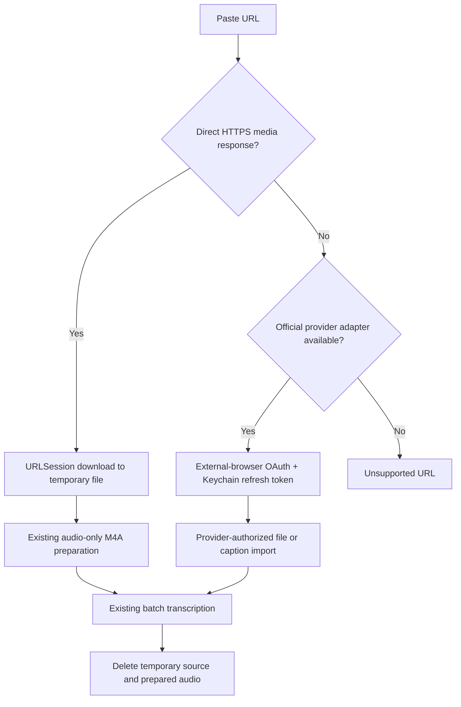

# URL Video Transcription: Authentication, YouTube, and macOS Feasibility

Date: 2026-07-22

Scope: a Diduny macOS flow where the user pastes a media or page URL, authenticates when necessary, and Diduny feeds audio into the existing file-transcription pipeline. The focus is YouTube, Google authorization, subsequent unattended use, and the smallest maintainable implementation.

## Recommendation

Do **not** design this as “Google OAuth gives Diduny the YouTube video.” It does not.

Ship URL transcription in two deliberately separate lanes:

1. **Supported product lane:** accept direct HTTPS media URLs (including signed URLs) and, later, provider integrations that officially expose downloadable media. Download to a temporary file with `URLSessionDownloadTask`, pass that file to the existing `ImportedMediaAudioPreparer` and `FileTranscriptionBatchService`, then remove it. This is headless after the user supplies a usable URL and reuses Diduny's current disk-backed pipeline.
2. **Optional internal/power-user experiment:** invoke a **user-installed** `yt-dlp` executable and let it read an already-authorized browser profile with `--cookies-from-browser`. This can run unattended after the user signs into YouTube in that browser, but it is not Google OAuth, is operationally brittle, and is not a safe default for a distributed Diduny feature. YouTube's general Terms prohibit downloading and automated access except where the service, YouTube/rightsholders, or applicable law permits it; the developer policy additionally prohibits downloading, isolating audio, background playback, and undocumented access without approval.[^youtube-terms][^youtube-policy]

Do not build a custom embedded login browser, a headless Chromium stack, or browser-audio recording as the first implementation. They add more code and worse security while failing to create an official route to YouTube media.

## Key finding: OAuth is not a media-download grant

Google access tokens are scoped to documented Google API operations. A token for one API or scope does not grant unrelated access, and the YouTube Data API's documented `videos` methods expose metadata and management operations—not a video-byte download endpoint.[^google-oauth-overview][^youtube-videos-list]

Even for a video owner, `videos.list(part=fileDetails)` returns metadata about the originally uploaded file, such as filename, size, codecs, and duration; it does not return the file itself.[^youtube-video-resource] YouTube's official help directs owners to download their own uploads through YouTube Studio or Google Takeout, and says other users' videos cannot be downloaded as normal files.[^youtube-own-download]

The captions API is narrower than the requested feature:

- `captions.list` and `captions.download` require OAuth authorization.[^youtube-caption-guide]
- `captions.download` only works when the authorized account has sufficient permission for that caption track; otherwise it returns `403 forbidden`.[^youtube-caption-download]
- It returns an existing caption track, not the video's audio. This could support a future **Import existing YouTube captions for videos you control** feature, but it cannot transcribe arbitrary public or private videos.

Therefore Google authorization can support metadata and eligible owner-controlled captions, but not the requested arbitrary/private video-byte acquisition.

## Authentication UX on macOS

### Official Google OAuth flow

If Diduny adds a legitimate YouTube API feature, use a Desktop OAuth client, Authorization Code + PKCE, and an external browser. RFC 8252 requires native apps to use an external user-agent and PKCE; a loopback IP redirect is an established desktop pattern.[^rfc8252] Google also prohibits directing OAuth requests to an embedded user-agent controlled by the app, and continues to support loopback redirects for Desktop app clients.[^google-oauth-policy][^google-loopback]

On macOS, `ASWebAuthenticationSession` opens the default browser (or Safari) and returns the callback to the invoking app, so it fits the required external-user-agent boundary.[^apple-web-auth]

Store the refresh token—not a password—in the macOS Keychain. Google says refresh tokens are the mechanism for later access without the user at the browser and may be revoked or expire; Apple positions Keychain Services as encrypted storage for small secrets.[^google-oauth-overview][^apple-keychain] Subsequent API calls can then be headless until consent, token validity, or account policy requires reauthentication.

This OAuth session still cannot authenticate `yt-dlp`. OAuth bearer tokens authorize documented API calls; `yt-dlp` uses website/session cookies and extractor-specific web requests.

### Browser-cookie flow

`yt-dlp --cookies-from-browser` supports Safari, Chrome, Chromium, Brave, Edge, Firefox, Opera, Vivaldi, and Whale. On macOS its implementation reads browser cookie databases and, for Chromium browsers, obtains the browser's Safe Storage secret from the macOS Keychain to decrypt cookies.[^ytdlp-options][^ytdlp-cookie-source]

The least-bad storage design for this experimental route is: **do not copy or persist cookies in Diduny at all**. Keep authorization in the user's browser profile and invoke `yt-dlp --cookies-from-browser <browser[:profile]>` for each job. The official yt-dlp FAQ warns that exporting a cookie file can export cookies for all sites and must be protected accordingly.[^ytdlp-cookie-faq]

Operational caveats:

- Browser cookie database and Keychain access can trigger macOS privacy/Keychain prompts and can fail as browser storage formats change.
- Reading a user's main browser profile gives the helper access to a much broader credential set than the one YouTube URL being processed. A dedicated browser profile reduces blast radius, but creating and controlling profiles is browser-specific work.
- A WebKit login window is not a shortcut: `WKWebsiteDataStore` has its own persistent cookie store, while Google's policy prohibits an app-controlled embedded OAuth user-agent.[^apple-webkit-store][^google-oauth-policy]
- The browser session may expire or be challenged at any time. The correct state is “authorization required,” not silent retry loops.

## `yt-dlp` feasibility and cost

Technically, yt-dlp is the shortest route to broad URL support:

- It is a command-line downloader supporting thousands of sites and can load browser cookies.[^ytdlp-repo][^ytdlp-options]
- `-x --extract-audio --audio-format m4a` produces an audio-only file, but requires `ffmpeg` and `ffprobe`.[^ytdlp-audio]
- The project publishes a universal macOS 10.15+ standalone executable.[^ytdlp-macos]

It is not a single stable dependency:

- Full current YouTube support also recommends `yt-dlp-ejs` and an external JavaScript runtime such as Deno or Node, in addition to ffmpeg/ffprobe.[^ytdlp-dependencies]
- The project says its stable channel can become stale and break when sites change; updates are a normal operational requirement.[^ytdlp-update]
- yt-dlp source is Unlicense, but its PyInstaller-bundled executables contain GPLv3+ code; ffmpeg licensing depends on the chosen build. Shipping these binaries requires separate license and distribution review.[^ytdlp-license]
- Apple requires distributed executables to be properly signed and the deliverable to pass notarization checks. Runtime self-updating a helper inside the signed app bundle is therefore the wrong lifecycle; it would also create a supply-chain path outside Diduny's normal release process.[^apple-notarization] The final sentence is an architectural inference from Apple's signing/notarization requirements.

Minimal experimental integration, if explicitly accepted:

1. An Advanced setting stores only the selected `yt-dlp` executable URL and browser/profile choice.
2. Diduny invokes `Process` directly with an argument array—never through a shell—and accepts only `https` URLs.
3. Try public extraction first. On an authentication error, show “Sign in using your browser,” open the URL in the chosen browser, and let the user retry.
4. For retry, add `--cookies-from-browser`; do not emit a cookie file.
5. Ask yt-dlp for metadata before download, reject playlists by default, enforce Diduny's 300-minute per-item limit, and reject live streams for v1.
6. Download one audio source to a private temporary directory, then enqueue it through the existing batch pipeline. Clean the helper output on completion, failure, or cancellation.
7. Do not auto-update the helper from Diduny. Report an outdated-helper error and let the user update their external installation.

This is suitable only as an explicit, unsupported personal/internal capability. It should not be presented as a Google-authorized YouTube integration.

## Browser playback + system-audio capture

Diduny already has `SystemAudioCaptureService`, so recording browser playback is technically possible with less new media code than a browser automation stack. ScreenCaptureKit can capture audio from a selected display, app, or window and emits audio sample buffers; the first use requires Screen Recording permission and an app restart.[^apple-screen-capture]

It is still a poor URL-ingestion fallback:

- Capture is real-time: a three-hour video takes three hours.
- The browser must be running and playing the media. That is unattended after start, but not truly headless.
- Browser ads, notifications, other tabs, playback stalls, and system sounds can contaminate the recording unless capture is carefully isolated.
- Protected/DRM content may not produce usable capture.
- YouTube's policy separately prohibits isolating audio and background players, so hiding the player does not make this a compliant YouTube workflow.[^youtube-policy]

Use this only as a user-visible “record system audio” workflow that already exists conceptually in Diduny, not as automatic URL transcription.

## Recommended product architecture

### Phase 1: direct media URLs

Add one small source adapter in front of `FileTranscriptionBatchService`:

- Validate scheme and redirects (`https` only; block local/private-network destinations to prevent SSRF).
- Use `URLSessionDownloadTask`, which writes the response to a temporary file and exposes byte progress without loading the media into memory.[^apple-download]
- Validate final MIME type and AVFoundation tracks instead of trusting the extension or initial `Content-Type`.
- Enforce redirect count, maximum expected/downloaded bytes, free-disk-space checks, cancellation, and the existing 300-minute duration limit.
- Add the resolved page/media URL as source metadata for duplicate detection.
- Never retain the downloaded source video after audio preparation.

No browser, OAuth, new dependency, or new media converter is required.

### Phase 2: official provider adapters only when justified

Define an adapter only after a real provider exposes a documented media or caption API. For Google/YouTube, the only initially defensible adapter is importing eligible caption tracks or directing owners to export their own uploaded video. Use `ASWebAuthenticationSession`, Desktop OAuth + PKCE, and Keychain refresh-token storage.

### Phase 3: optional external-helper experiment

If personal YouTube transcription remains a priority after accepting policy and maintenance risk, add the user-installed yt-dlp bridge behind an Advanced/Experimental flag. Do not bundle Chromium, ffmpeg, Deno, or yt-dlp into the first product version.

## UX states

Keep the URL item in the same batch UI and add only source-acquisition states:

- `checkingLink`
- `authorizationRequired`
- `downloading` with byte progress
- existing `preparing`, `uploading`, `processing`, `finalizing`, `completed`, `failed`, and `cancelled`

For an existing eligible caption, mark the item as reused/imported and avoid transcription. For unsupported page URLs, explain the boundary: “This page does not provide a downloadable media file. Download a file you have permission to use, then add it to Diduny.”

## Decision table

| Approach | First auth | Later headless | Gets arbitrary YouTube audio | Product-safe default | Maintenance |
|---|---|---:|---:|---:|---:|
| Direct media URL + `URLSession` | URL itself / signed URL | Yes | No | Yes | Low |
| YouTube Data API OAuth | External browser | Yes, with refresh token | No; metadata/eligible captions only | Yes | Medium |
| User-installed yt-dlp + browser cookies | Login in normal browser | Usually | Technically often | No | High |
| Embedded `WKWebView` Google login | Embedded view | Potentially | No official media path | No | High |
| Browser playback + ScreenCaptureKit | Browser login + capture permission | No; playback must run | Real-time capture only | No for YouTube automation | Medium/high |
| Bundled headless Chromium automation | Interactive login/challenges | Unreliable | Technically sometimes | No | Very high |

## Risks and acceptance gates

Before any YouTube downloader work, decide explicitly:

1. Is this a distributed Diduny product feature or a personal/internal tool?
2. Will Diduny seek YouTube's written approval for downloading/transcription, or accept that the experimental flow may violate platform terms?
3. Will only owner-controlled/licensed content be accepted, and how will that be communicated?
4. Is dependence on a user-installed, frequently updated external executable acceptable?
5. Is granting access to a browser profile's cookie database acceptable, or must a dedicated profile be required?

Without affirmative answers, stop at direct media URLs and official caption import.

## Sources

[^google-oauth-overview]: Google, [Using OAuth 2.0 to Access Google APIs](https://developers.google.com/identity/protocols/oauth2).
[^youtube-videos-list]: YouTube Data API, [`videos.list`](https://developers.google.com/youtube/v3/docs/videos/list).
[^youtube-video-resource]: YouTube Data API, [Video resource](https://developers.google.com/youtube/v3/docs/videos).
[^youtube-own-download]: YouTube Help, [Download YouTube videos that you've uploaded](https://support.google.com/youtube/answer/56100).
[^youtube-caption-guide]: YouTube Data API, [Implementation: Captions](https://developers.google.com/youtube/v3/guides/implementation/captions).
[^youtube-caption-download]: YouTube Data API, [`captions.download`](https://developers.google.com/youtube/v3/docs/captions/download).
[^rfc8252]: IETF, [RFC 8252: OAuth 2.0 for Native Apps](https://www.rfc-editor.org/rfc/rfc8252).
[^google-oauth-policy]: Google, [OAuth 2.0 Policies](https://developers.google.com/identity/protocols/oauth2/policies).
[^google-loopback]: Google, [Loopback IP Address flow Migration Guide](https://developers.google.com/identity/protocols/oauth2/resources/loopback-migration).
[^apple-web-auth]: Apple, [`ASWebAuthenticationSession`](https://developer.apple.com/documentation/authenticationservices/aswebauthenticationsession).
[^apple-keychain]: Apple, [Keychain services](https://developer.apple.com/documentation/security/keychain-services).
[^ytdlp-options]: yt-dlp, [README: cookies from browser](https://github.com/yt-dlp/yt-dlp/blob/master/README.md#filesystem-options).
[^ytdlp-cookie-source]: yt-dlp, [`yt_dlp/cookies.py`](https://github.com/yt-dlp/yt-dlp/blob/master/yt_dlp/cookies.py).
[^ytdlp-cookie-faq]: yt-dlp, [FAQ: How do I pass cookies to yt-dlp?](https://github.com/yt-dlp/yt-dlp/wiki/FAQ#how-do-i-pass-cookies-to-yt-dlp).
[^apple-webkit-store]: Apple, [`WKWebsiteDataStore`](https://developer.apple.com/documentation/webkit/wkwebsitedatastore).
[^ytdlp-repo]: yt-dlp, [Official repository](https://github.com/yt-dlp/yt-dlp).
[^ytdlp-audio]: yt-dlp, [README: Post-Processing Options](https://github.com/yt-dlp/yt-dlp/blob/master/README.md#post-processing-options).
[^ytdlp-macos]: yt-dlp, [README: Release Files](https://github.com/yt-dlp/yt-dlp/blob/master/README.md#release-files).
[^ytdlp-dependencies]: yt-dlp, [README: Dependencies](https://github.com/yt-dlp/yt-dlp/blob/master/README.md#dependencies).
[^ytdlp-update]: yt-dlp, [README: Update](https://github.com/yt-dlp/yt-dlp/blob/master/README.md#update).
[^ytdlp-license]: yt-dlp, [README: Licensing](https://github.com/yt-dlp/yt-dlp/blob/master/README.md#licensing).
[^apple-notarization]: Apple, [Notarizing macOS software before distribution](https://developer.apple.com/documentation/security/notarizing-macos-software-before-distribution).
[^apple-screen-capture]: Apple, [Capturing screen content in macOS](https://developer.apple.com/documentation/screencapturekit/capturing-screen-content-in-macos).
[^youtube-terms]: YouTube, [Terms of Service: Permissions and Restrictions](https://www.youtube.com/static?template=terms#permissions-restrictions).
[^youtube-policy]: YouTube, [YouTube API Services Developer Policies](https://developers.google.com/youtube/terms/developer-policies#e.-handling-youtube-data-and-content).
[^apple-download]: Apple, [`URLSessionDownloadTask`](https://developer.apple.com/documentation/foundation/urlsessiondownloadtask).
